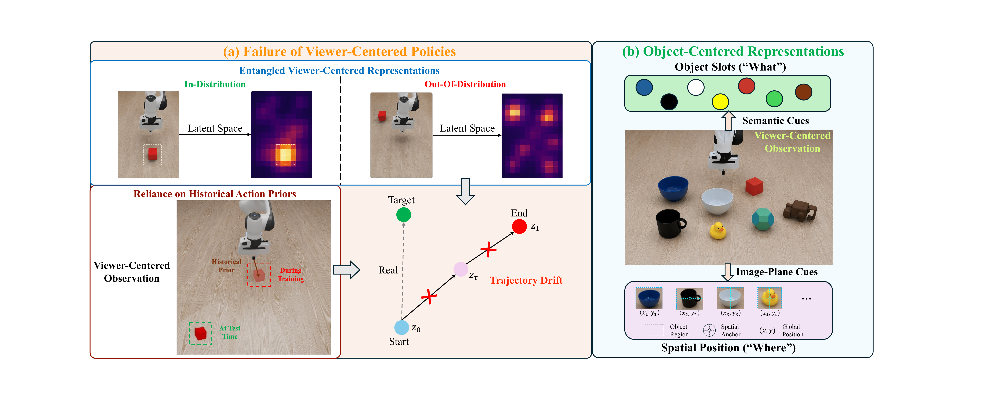
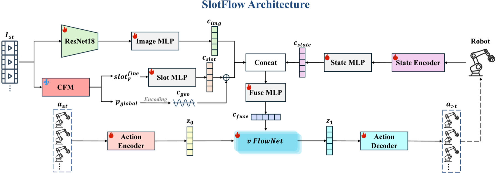

# Object-Centric Conditioning for Visuomotor Flow Matching

<p align="center">
  
</p>

Official repository for the paper **Object-Centric Conditioning for Visuomotor Flow Matching**.

[**Jijie Li**](https://li-jijie.github.io)<sup>1,2</sup>, **Xu Yang**<sup>1,2</sup>, **Junhong Zou**<sup>1,2</sup>, **Chunhai Zhao**<sup>3</sup>, **Chaoyang Zhao**<sup>1,3,*</sup>, [**Zhen Lei**](https://www.cbsr.ia.ac.cn/users/zlei/)<sup>1,2,4,5</sup>, and [**Xiangyu Zhu**](https://xiangyuzhu-open.github.io/homepage/)<sup>1,2,*</sup>

<sup>1</sup>School of Artificial Intelligence, University of Chinese Academy of Sciences<br>
<sup>2</sup>State Key Laboratory of Multimodal Artificial Intelligence Systems, Institute of Automation, Chinese Academy of Sciences<br>
<sup>3</sup>Foundation Model Research Center, Institute of Automation, Chinese Academy of Sciences<br>
<sup>4</sup>Centre for Artificial Intelligence and Robotics, Hong Kong Institute of Science & Innovation, Chinese Academy of Sciences<br>
<sup>5</sup>School of Computer Science and Engineering, Faculty of Innovation Engineering, Macau University of Science and Technology<br>
<sup>*</sup>Corresponding authors

**[Paper](PAPER_LINK)** · **[Project Page](PROJECT_PAGE_LINK)** · **[Video](VIDEO_LINK)** · **[Model Zoo](MODEL_ZOO_LINK)**

> **Release status:** The repository is being prepared for public release. Code, checkpoints, and reproduction instructions will be added progressively.

## Abstract

History-conditioned visuomotor policies can struggle when the current scene differs from the historical context used to initialize action generation. We present **SlotFlow**, an object-centric flow-matching policy that improves current-state grounding while preserving the efficiency of history-conditioned inference. SlotFlow introduces a Cascaded Foveated Module (CFM) that extracts object-centric semantic features and lightweight image-plane spatial cues through coarse-to-fine perception. These complementary signals are injected into the flow-generation pathway to improve robustness under visual distractors, kinematic perturbations, and object-position shifts.

<p align="center">
  
</p>

## Method

SlotFlow consists of three main components:

1. **Object-centric semantic conditioning:** foreground slots provide task-relevant object identity and appearance information while suppressing irrelevant scene context.
2. **Image-plane spatial conditioning:** a normalized object centroid is encoded as a lightweight spatial cue for current-location grounding.
3. **Cascaded foveated perception:** a coarse global stage proposes an object region, and a fine high-resolution stage refines the local representation and spatial anchor.

The resulting semantic and spatial representations are fused with visual, proprioceptive, and historical-action features in a low-step flow-matching policy.

## Results

SlotFlow is evaluated on Roboverse manipulation tasks under visual distractors, kinematic perturbations, and object-position shifts.

<p align="center">
  
</p>

Additional results, controlled ablations, and real-world demonstrations are included in the supplementary material.

## Installation

> **TODO:** Add the tested operating system, CUDA, PyTorch, and Python versions.

```bash
git clone https://github.com/Li-Jijie/Object-Centric-Visuomotor-Flow.git
cd Object-Centric-Visuomotor-Flow

# TODO: add environment creation and dependency installation commands
```

## Data and Checkpoints

> **TODO:** Add dataset preparation instructions, download links, license information, and checkpoint URLs.

Expected resource layout:

```text
resources/
├── datasets/
├── checkpoints/
└── assets/
```

Please do not commit large checkpoints or private datasets directly to the repository. Link them from a release page or an external storage service instead.

## Quick Start

> **TODO:** Replace the commands below with the tested commands from the released implementation.

```bash
# Train SlotFlow
python scripts/train.py --config configs/slotflow.yaml

# Evaluate on a benchmark task
python scripts/evaluate.py --config configs/eval_close_box.yaml \
    --checkpoint /path/to/checkpoint

# Generate qualitative visualizations
python scripts/visualize.py --config configs/eval_close_box.yaml \
    --checkpoint /path/to/checkpoint
```

## Reproducing the Paper

The release will include configuration files and scripts for Close Box, Pick Cube, and Push Cube evaluation; visual, kinematic, and spatial perturbation protocols; core component ablations; reviewer-motivated controls; mid-rollout object displacement experiments; and real-world UR3 evaluation, subject to hardware and dataset availability.

## Visualization and Demo

<p align="center">
  
</p>

**Demo video:** [VIDEO_LINK]

**Project website:** [PROJECT_PAGE_LINK]

## Citation

If you find this work useful, please cite:

```bibtex
@inproceedings{li2026objectcentric,
  title     = {Object-Centric Conditioning for Visuomotor Flow Matching},
  author    = {Li, Jijie and Yang, Xu and Zou, Junhong and Zhao, Chunhai and Zhao, Chaoyang and Lei, Zhen and Zhu, Xiangyu},
  booktitle = {Proceedings of the Conference on Robot Learning},
  year      = {2026}
}
```

## Acknowledgements

This work was supported by the Strategic Priority Research Program of Chinese Academy of Sciences under Grant XDA0480103, Chinese National Natural Science Foundation Projects 92570119, the Science and Technology Development Fund of Macau Project 0140/2024/AGJ, and InnoHK program.

## License

> **TODO:** Add the final open-source license and any third-party software notices before publication.
